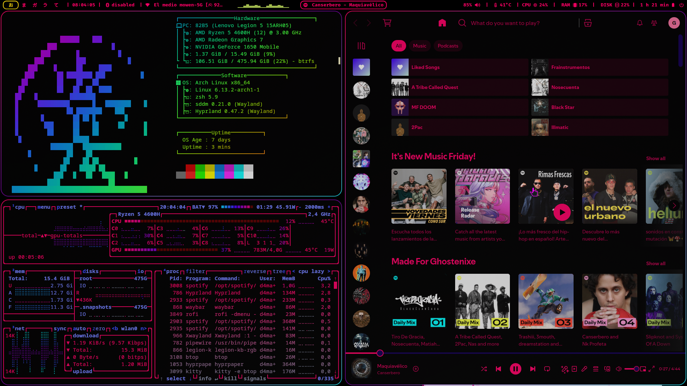
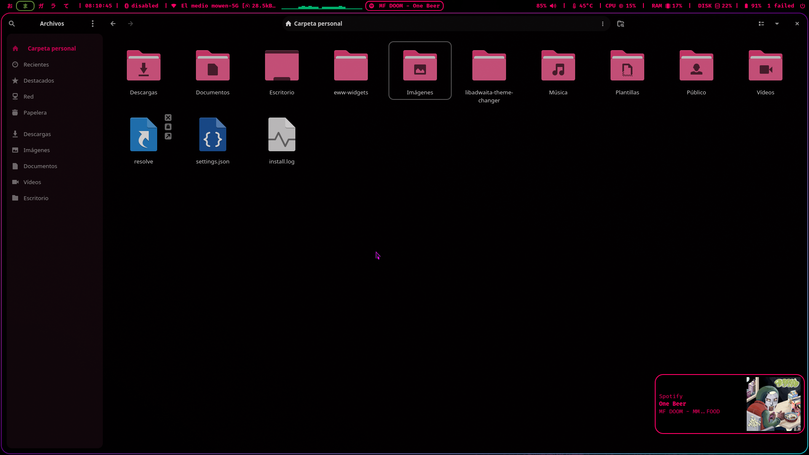
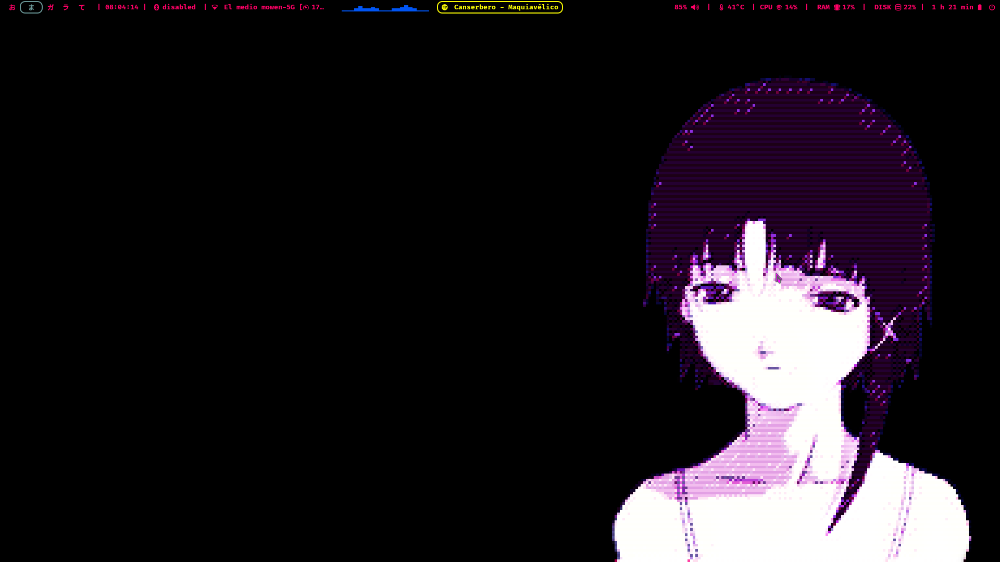

# Dotfiles
Dotfiles of my Hyprland + Arch linux setup
## Setup preview

  

Individual configs are on the [Wiki](https://github.com/Axel-DaMage/Dotfiles/wiki) page.
---
Features:

* RGB Lightning animation on Waybar when music is playing, also there is RGB when the laptop is charging, in cava and window workflow pointer.

* Easy configuration, draw and drop the config files.

* Variated animations on Hyprland windows and waybar.

* Custom theming for: Waybar, Firefox, Btop, Dunst, Hyprland, Spotify, Discord, Vscode (working on it), Hypridle, Nautilus, Rofi, Fastfetch, ZSH.
---
Dependencies:

For these dotfiles you may need to install dependencies, this is a list of the requeriments.

* Waybar
 * For waybar you need to install a compiled version with cava module enabled or it won't work.
* Spotify
 * You need to install spicetify and search your theme, you may need to install the CSS editer extensión.

